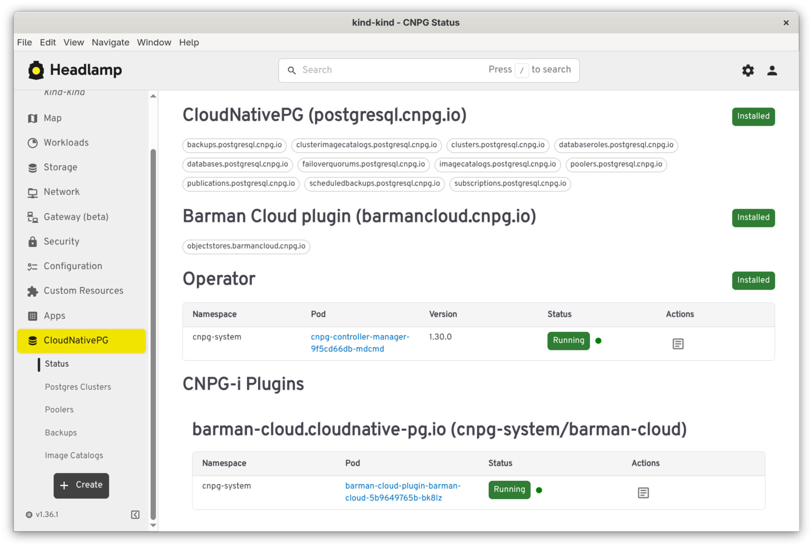
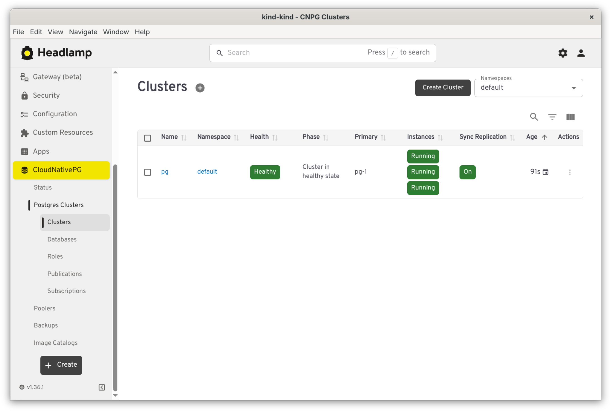
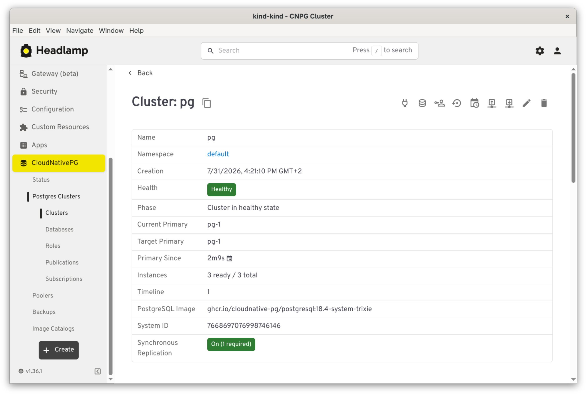
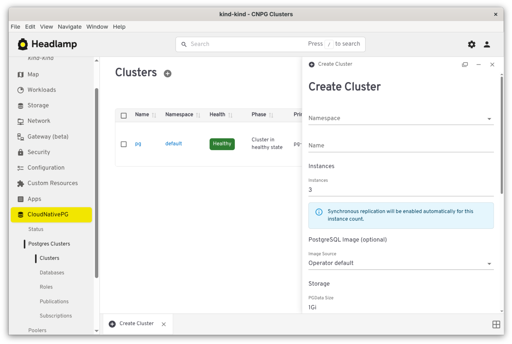
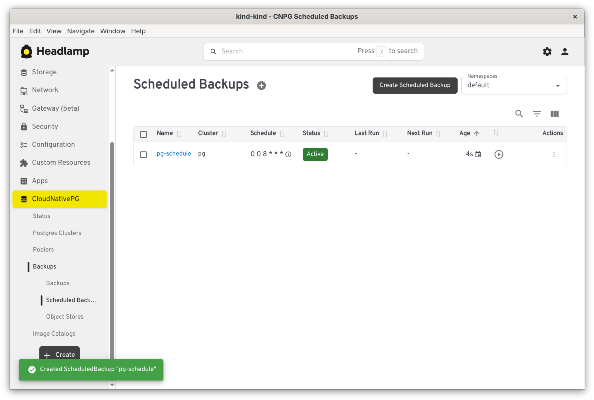
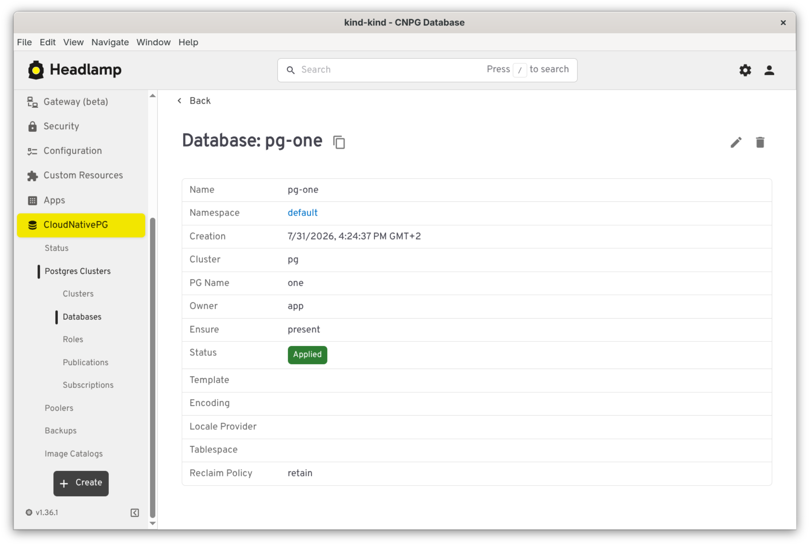

# CNPG Headlamp Plugin

A [Headlamp](https://headlamp.dev/) plugin for managing and visualizing [CloudNativePG](https://cloudnative-pg.io/) (CNPG) resources — Clusters, Poolers, Backups, Scheduled Backups, and Database objects — directly from the Headlamp UI.

## Features

- **Clusters** — list and detail views with a traffic-light health indicator (phase, WAL archiving, last backup), instance roles and synchronous replication warnings, per-instance Postgres logs (filterable, color-coded, live-following), and a `psql` terminal against the primary or any replica. A guided creation form (with live YAML preview) covers instances/HA, storage and tablespaces, backup configuration, volume snapshots, and bootstrap — including bootstrapping a new cluster from an existing backup
- **Poolers** (PgBouncer) — list/detail views and a guided creation form
- **Backups** — on-demand backups with status tracking, created against the Barman Cloud plugin or via volume snapshots (not the deprecated in-tree `barmanObjectStore`)
- **Scheduled Backups** — graphical cron editor (Daily/Weekly/Monthly, plus a raw-text advanced mode) with a humanized schedule description, and a "trigger now" action
- **Object Stores** — manage the `ObjectStore` CRs backing the Barman Cloud plugin, with a "referring clusters" section showing which clusters use each store for backup and/or recovery
- **Database objects** — list/detail/create views for `Database`, `DatabaseRole`, `Publication`, and `Subscription`, each showing reconciliation status
- **Image Catalogs / Cluster Image Catalogs** — list and detail views for managing available Postgres operand images
- **Operator status page** — installed CNPG CRDs, operator pod health, and detected CNPG-i plugins (e.g. Barman Cloud), with quick access to their logs

## Requirements

**To develop this plugin:**

- [mise](https://mise.jdx.dev/) — manages the Node.js/npm versions used by this project
- A local [Headlamp](https://headlamp.dev/) installation to load the plugin into

Once packaged and distributed, the plugin only requires a [Headlamp](https://headlamp.dev/) installation to run — `mise` is a development-time dependency only.

## Installation (local Headlamp)

From the repo root:

```bash
mise exec -- npm install
mise exec -- npm start
```

`npm start` builds the plugin in watch mode; load it into your running Headlamp instance to see it, and changes will rebuild automatically as you edit.

## Screenshots

<table>
  <tr>
    <td></td>
    <td></td>
  </tr>
  <tr>
    <td></td>
    <td></td>
  </tr>
  <tr>
    <td></td>
    <td></td>
  </tr>
</table>

## License

Licensed under the [Apache License 2.0](LICENSE).
