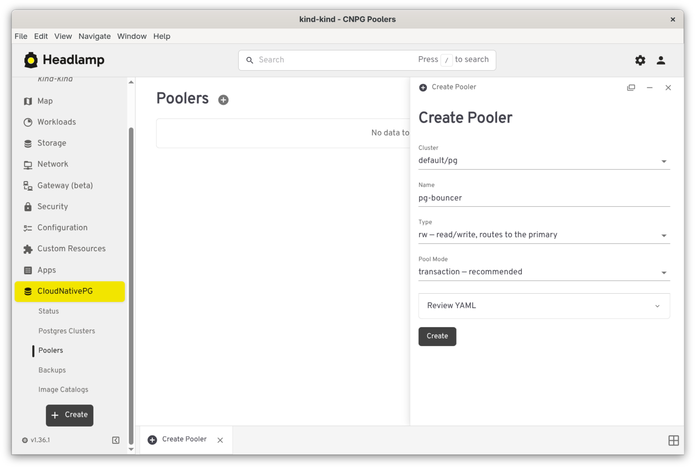
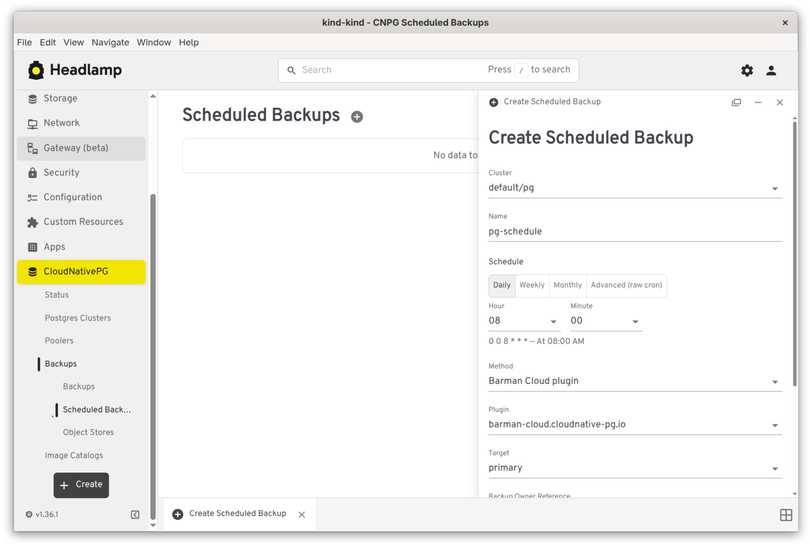
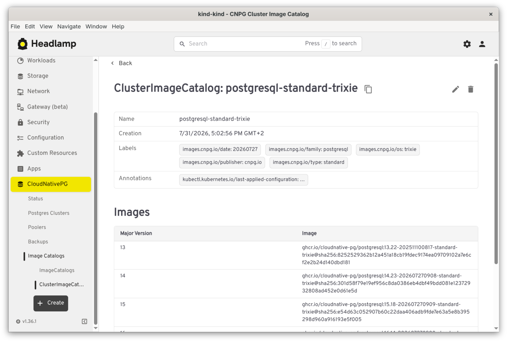

# CloudNativePG Plugin for Headlamp

Managing and visualizing CloudNativePG (CNPG) Postgres clusters directly inside [Headlamp](https://headlamp.dev/)

<!-- Welcome everyone. Quick framing before diving in: this is a Headlamp plugin, so if the audience already knows Headlamp as "the Kubernetes UI", that's the right mental model to anchor on. -->

---

## The problem

- CloudNativePG manages Postgres via Kubernetes CRDs (`Cluster`, `Pooler`, `Backup`, ...)
- Operating it today means `kubectl` + `kubectl cnpg` + reading YAML by hand
- No visual, cluster-context-aware way to inspect health, backups, or topology
- Headlamp is already the Kubernetes UI many teams run — CNPG deserved a first-class citizen there

<!-- Pause here for a show of hands: who's operated CNPG via kubectl/cnpg plugin day to day? Use their pain points as the segue into the next slide instead of just reading the bullets. -->

---

## What this plugin is

A Headlamp plugin that surfaces CNPG resources as native list/detail views:

- Guided creation forms with live YAML preview
- Visual health/status indicators, not raw `status` fields
- One-click actions — trigger backup, open `psql`, tail logs

<!-- This is the elevator pitch slide — if someone has to leave after one slide, this is the one that matters. Everything after this is a feature-by-feature drill-down, so it's fine to move quickly if time is short. -->

---

## Clusters — operate

- Traffic-light health: phase, WAL archiving, last backup
- Instance roles & replication warnings
- Live per-instance Postgres logs
- `psql` terminal, no `kubectl exec` needed

<!-- Emphasize the psql terminal — it's the detail that usually gets an audible reaction, since it removes a whole class of kubectl exec / port-forward busywork. -->

---


<!-- This is the cluster detail page. Point out the health traffic light at the top and the instance/replica list — that's what "phase, WAL archiving, last backup" from the previous slide looks like in practice. -->

---

## Clusters — create

- Guided form with live YAML preview
- Instances, storage & tablespaces
- Backup config & volume snapshots
- Bootstrap from an existing backup

<!-- Mention that the YAML preview updates live as fields are filled in — useful for people who want to learn the CRD shape, not just click through a form blindly. -->

---


<!-- Point at the live YAML preview panel specifically — it's easy to miss in a screenshot but it's the detail worth calling out live. -->

---

## Poolers & Backups

- **Poolers (PgBouncer)** — list/detail + guided creation
- **Backups** — on-demand, with status tracking
- Created via the Barman Cloud plugin or volume snapshots

<!-- Worth noting explicitly: backups target the Barman Cloud CNPG-i plugin, not the deprecated in-tree barmanObjectStore field. If anyone asks about the old barmanObjectStore config, that's the answer. -->

---



<!-- Pooler creation form — a good moment to mention PgBouncer connection pooling briefly if the audience isn't already familiar with why poolers matter for Postgres at scale. -->

---

## Scheduled Backups

- Graphical cron editor — Daily / Weekly / Monthly
- Raw-text advanced mode
- Humanized schedule + "trigger now" action

<!-- The humanized schedule description ("every day at 3am") is aimed at people who don't want to mentally parse cron syntax — call that out as the target user. -->

---



<!-- Show the toggle between the graphical editor and the raw-text advanced mode if time allows — it's a nice escape hatch for schedules the graphical UI can't express. -->

---

## Object Stores

- Manage `ObjectStore` CRs behind the Barman Cloud plugin
- "Referring clusters" — which clusters use each store
- Shows backup and/or recovery role per cluster

<!-- No screenshot for this one yet — describe the "referring clusters" list verbally: it answers "which clusters break if I delete this store", which is the real question people have before touching one. -->

---

## Database objects

- `Database`, `DatabaseRole`, `Publication`, `Subscription`
- List / detail / create views
- Reconciliation status at a glance

<!-- These four CRDs let you manage in-database objects (databases, roles, logical replication) declaratively through Kubernetes instead of connecting with psql by hand. -->

---


<!-- Point out the reconciliation status shown here — it's the same "did the operator actually apply this yet" question people ask about any CNPG CRD. -->

---

## Image Catalogs

- Manage available Postgres operand images
- Namespaced Image Catalogs & cluster-wide Cluster Image Catalogs

<!-- Keep this one brief — it's a smaller, more niche feature (managing which Postgres operand images are available for clusters to use). Don't over-invest time here relative to Clusters/Backups. -->

---



<!-- Cluster-scoped image catalog detail — note there's no namespace in this one's URL/route, unlike the namespaced Image Catalog. -->

---

## Operator status

- Installed CNPG CRDs & operator pod health
- Detected CNPG-i plugins (e.g. Barman Cloud) + quick log access
- Answers "is CNPG even installed correctly?" first

<!-- This is the page the sidebar's top-level "CloudNativePG" entry links to directly, not the cluster list — because "is this even installed correctly" is the first question people have when they open the plugin. -->

---


<!-- Good closing screenshot for the feature tour — it ties back to the very first "problem" slide by showing the operator/plugin health at a glance. -->

---

## Try it

```bash
mise exec -- npm install
mise exec -- npm start
```

Load the built plugin into a running Headlamp instance — changes rebuild automatically in watch mode.

Apache 2.0 licensed

<!-- If doing a live demo, this is the cue to switch over to the actual running Headlamp instance instead of continuing with slides. -->

---

# Questions?

<!-- Leave this slide up during Q&A — it has no other content to distract from, and paginate is on so people can reference earlier slide numbers when asking questions. -->
